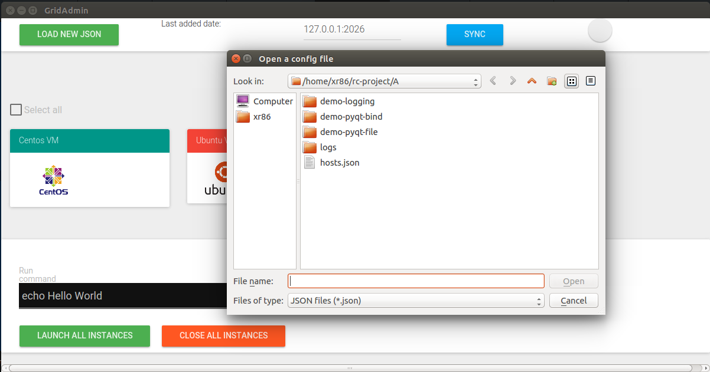

# rcproj
Computer Networks Project

**This application is a PoC, hasn't been finished yet.**  
GridAdmin is an application to run commands over a network specified in `json` format. It uses a PyQt client (python) (`named A`) that connects to a buffer C server (`named B`), and that server establishes contact with a Paramiko server (python) (`named C`).

> Current client implementation

### :exclamation: Notes:
+ old project moved to `old/`
+ documentation in `docs/`:
  + LNCS documentation in `docs/demo-docs/`  
  + presentation documentation in `demo/final/`  
+ stubs/useful code in `demo/`
