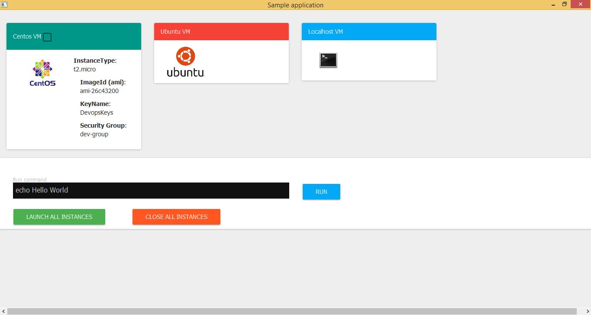
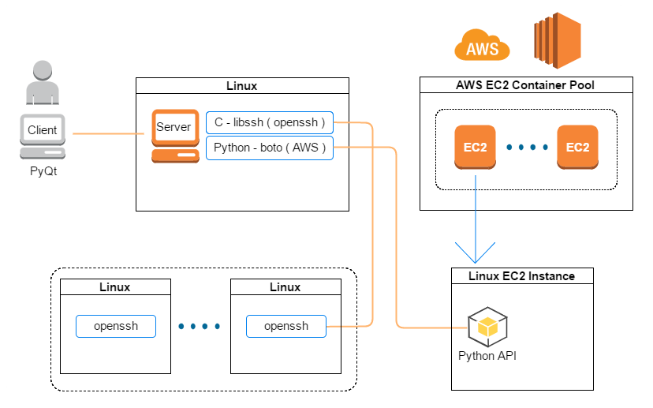

# rcproj
Computer Networks Project

## Files:
+ `app-layer.png` / `client.png` - app architecture / screenshot
+ `main.tex` - main tex file used for documentation
+ `tema-2-rc.zip` - .tex with dependencies needed
+ `tema-2-rc.pdf` - exported documentation

## Client:
<!--  -->

## Application Layer:
<!--  -->

